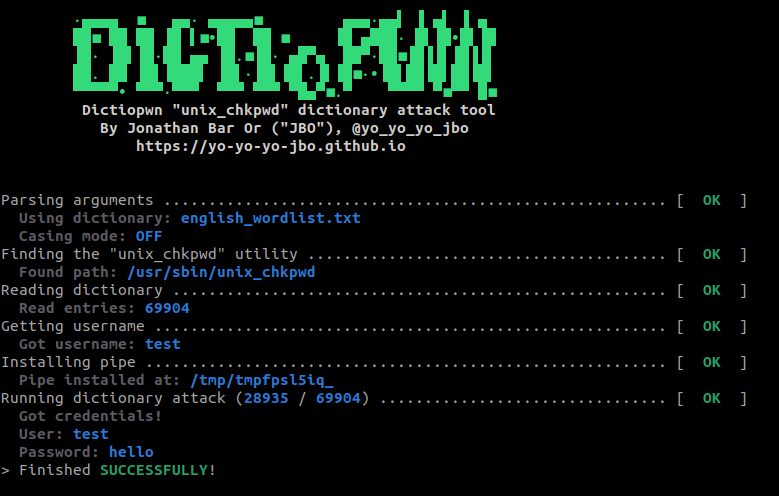

# Dictiopwn
Unix-based dictionary attack utility, based on the [unix_chkpwd](https://linux.die.net/man/8/unix_chkpwd) utility.



## How does it work
On many distributions, a SUID binary called `unix_chkpwd` exists and is being used by [PAM](https://en.m.wikipedia.org/wiki/Linux_PAM).  
That utility can read from its standard input (which is verified not to be a Terminal input) and compare its hash to the hash found in the `/etc/shadow` file.  
Generally that utility should only be used by `PAM` itself, but you can invoke it as a child process.  
In the past I have found that the hash comparison was a naive `memcmp`, which would expose the check to a [Timing side-channel attack](https://en.m.wikipedia.org/wiki/Timing_attack) but it seems to have been fixed since then.  
Nevertheless, since there is no lockout policy, an attacker could easily run a local dictionary attack to uncover the password.  
*Note*: the utility does create security audit logs.

## Usage
Installing dependencies:
```shell
python3 -m pip install -r ./requirements.txt
```

Running:
```
./dictiopwn.py -d DICT [-c]
```
- The `-d` flag is mandatory and specified the dictionary to be used. The dictionary should split attempts by linebreaks. I've included a [naive dictionary file](english_wordlist.txt) in the repository.
- The `-c` flag is optional and makes the utility attempt every casing option for each attempt, hence covering more options but making the dictionary attack run longer.

## Disclaimer
I release this tool for educational purposes only and provide it without warranty.  
Use this tool at your own risk.

## Detection
Besides examining the security audit logs, defenders are encouraged to look for anomalous parent processes of the `unix_chkpwd` utility.

Stay tuned!

Jonathan Bar Or
